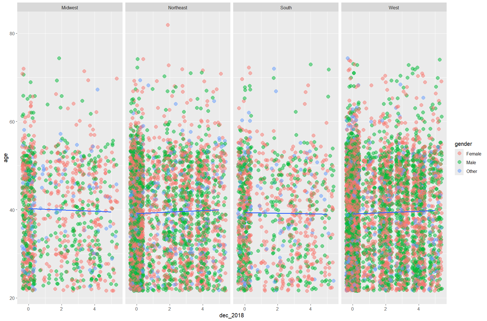
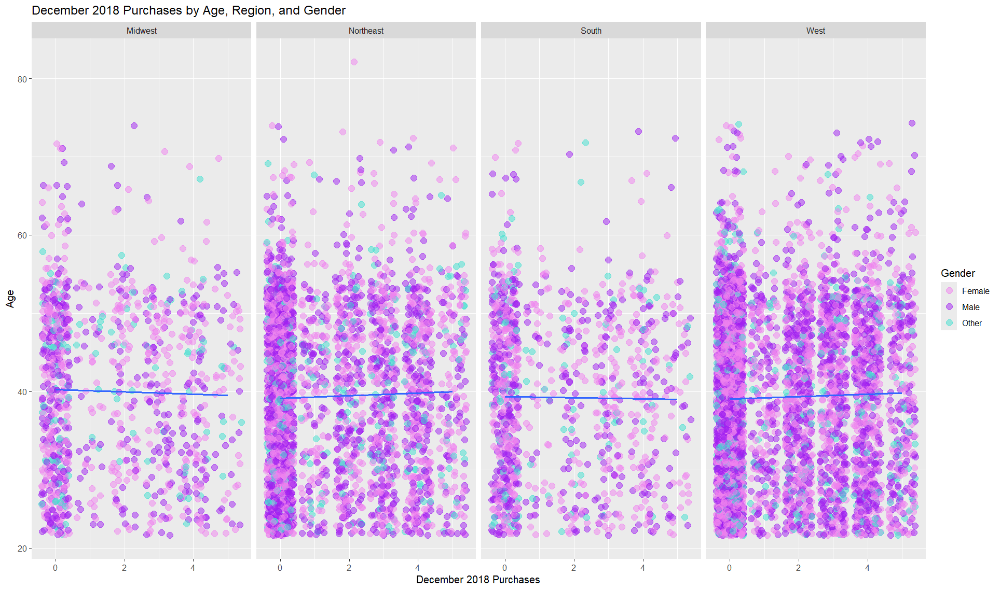
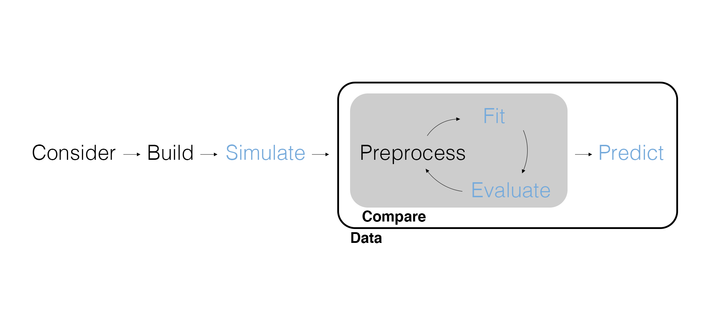

## Grades and Feedback

- If you lost points for the dashboard, show Ethan your .Rmd document to get points back
- Treat the projects like a formal report
  - Proofread! Make sure plots render.
  - Make your code/plots easy to read! Include comments and labels.

---

<center>

{width="900px"}

</center>

---

<center>

{width="1000px"}

</center>

## Grades and Feedback

- If you lost points for the dashboard, show Ethan your .Rmd document to get points back
- Treat the projects like a formal report
  - Proofread! Make sure plots render.
  - Make your code/plots easy to read! Include comments and labels.
- Follow the rubric closely when grading your exercises - email me if you have any uncertainty.

## Marketing Analytics Process

<center>
{width="900px"}
</center>

## Inferential Modeling Workflow

<center>
{width=900px}
</center>

---

{width=500px}

## Simulating Data Redux

Remember that once we have a model of the data generating process we can pretend that our model *is* the data generating process and simulate data.

```{r message=FALSE}
# Load packages.
library(tidyverse)
library(tidymodels)

# What's this again?!
set.seed(42)
```

---

```{r}
# Set variable and parameter values.
nobs <- 300
intercept <- 30
slope <- 9

# Simulate data.
sim_data_01 <- tibble(
  discount = round(runif(nobs, min = 0, max = 20)),
  sales = intercept + slope * discount + rnorm(nobs, mean = 0, sd = 5)
)

sim_data_01
```

---

```{r message=FALSE}
sim_data_01 |> 
  ggplot(aes(x = discount, y = sales)) +
  geom_jitter(size = 2, alpha = 0.5) +
  geom_smooth(method = "lm")
```


---

We can use the **binomial distribution** to simulate **binary** data. In a binary variable there are two **levels**, with the level equal to zero known as the **baseline level** or **reference level**.

```{r}
# Simulate some more data.
sim_data_02 <- tibble(
  coupon = rbinom(nobs, size = 1, prob = 0.7),
  sales = intercept + slope * coupon + rnorm(nobs, mean = 0, sd = 5)
)

sim_data_02
```

---

```{r message=FALSE}
sim_data_02 |> 
  ggplot(aes(x = coupon, y = sales)) +
  geom_jitter(size = 2, alpha = 0.5) +
  geom_smooth(method = "lm")
```

## Fit the Model

Remember that when we *fit* a linear model we are finding the line of best fit and getting *parameter estimates*.

```{r}
# Fit the first model.
fit_01 <- linear_reg() |> 
  set_engine("lm") |> 
  fit(sales ~ discount, data = sim_data_01)

# Fit the second model.
fit_02 <- linear_reg() |> 
  set_engine("lm") |> 
  fit(sales ~ coupon, data = sim_data_02)
```

## Parameter Estimates

Remember that our goal is to use the model to *estimate* the unobserved parameters from the data.

```{r}
# Evaluate model fit.
fit_01 |> 
  tidy()
```

---

<center>
{width=900px}
</center>

## How Do We Interpret Our Models?

$$sales = 29.80 + 9.01 \times discount$$

If $x$ is continuous:

- The intercept parameter $\beta_0$ represents the expected value of $y$ when $x$ is zero.
- The associated slope parameter $\beta_1$ represents the expected amount by which $y$ will change given a one unit increase in $x$.

---

What's different again about `sim_data_02`?

```{r}
# Evaluate model fit.
fit_02 |> 
  tidy()
```

---

$$sales = 29.60 + 9.07 \times coupon$$

If $x$ is discrete:

- The intercept parameter $\beta_0$ represents the expected value of $y$ when $x$ is equal to the *baseline level*.
- The associated slope parameter $\beta_1$ represents the expected amount by which $y$ will change **relative** to the *baseline level* of $x$.

## Intervals and Significance

So far the parameter estimates have been **point estimates**, a single number that represents our best guess.

But this is a statistical model -- there is always uncertainty (i.e., error). We can produce an **interval estimate** of the parameters, a range of numbers that represent our best guess.

```{r}
# Include confidence intervals.
tidy(fit_01, conf.int = TRUE)
```

---

These interval estimates are called **confidence intervals**. Given our model and the data, they are our best guess of the unobserved parameters.

If the confidence interval *doesn't include zero*, we can say that the parameter estimate is **statistically significant** (a.k.a., significant or significantly different from zero).

*We reach the same conclusion using a confidence interval as when using a p-value!*

```{r}
# Include confidence intervals.
tidy(fit_02, conf.int = TRUE)
```

## Let's Go on a Small Tangent...

We'll examine the properties of point estimates and confidence intervals using simulation.

## Model Comparison

Eventually we'll want to compare how well different models fit the same data. To do that efficiently we need a single number that describes the **overall model fit**.

```{r}
# Look at the r.squared.
glance(fit_01)
```

The $R^2$ is the percent of variation in $y$ that can be explained by the model (i.e., the explanatory variable(s)). Closer to 1 is better! This is easy to misuse, so it will be our measure of overall model fit only temporarily.

## Prediction

While the parameter estimates are often the object of interest for an inferential model, we of course can **predict** the outcome using the fitted model:

$$sales = 29.60 + 9.07 \times coupon$$

To predict the outcome we need new data that represents the *counterfactuals* we'd like to predict to feed into the fitted model.

```{r}
# Column names need to match the fitted model.
scenarios <- tibble(coupon = c(0, 1))
```

---

We can predict using the fitted model and the new data.

```{r}
# Predict and bind on the new data.
predict(fit_02, new_data = scenarios) |> 
  bind_cols(scenarios)
```

---

Remember that we have more than point estimates. We can compute confidence intervals for predictions as well (predictive intervals).

```{r}
# Predict and bind on prediction intervals.
bind_cols(
  predict(fit_02, new_data = scenarios),
  predict(fit_02, new_data = scenarios, type = "pred_int"),
  scenarios
)
```

## Recover Parameters

When we work with real data, it can be hard to tell the difference between doing something wrong with the model and doing something wrong with the code.

Another reason to simulate data is to prove that our code is working by **recovering the parameter values** we used to simulate the data.

```{r}
tidy(fit_01, conf.int = TRUE)
```

## Wrapping Up

*Summary*

- Discussed interpreting parameter estimates and statistical significance.
- Considered model comparison.
- Walked through prediction.
- Demonstrated parameter recovery.

*Next Time*

- Adding explanatory variables.

*Supplementary Material*

- *Tidy Modeling with R* Chapter 6.2-6.3

*Artwork by @allison_horst*

## Exercise 10

1. Simulate a single dataset with three variables: `discount` using a uniform distribution, `coupon` as a binary variable using the binomial distribution, and `sales` as a function of *only* `discount`, using a linear model.
2. Fit two models using {tidymodels}: `sales ~ discount` and `sales ~ discount + coupon`.
3. Evaluate model fit for both models. Compare parameter estimates and overall model fit. Which model is able to recover parameter values?
4. Using the best-fitting model, predict some possible counterfactuals.
5. Render the Quarto document into Word and upload to Canvas.

